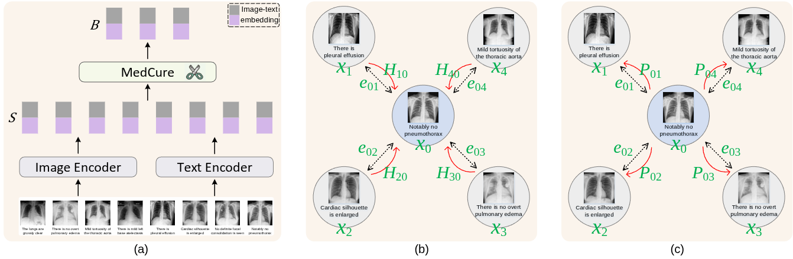

# MedCure: Medical Data Curation for Efficient Vision-Language Pretraining

MedCure pre-trains a CLIP-style medical foundation model while it selects its own
training data. Instead of filtering the corpus offline, the first epoch scores
every batch with a **graph-density** criterion, trains on the informative
fraction it keeps, and then freezes that subset. Every later epoch trains
only on the frozen subset, so the expensive image encoder never re-processes the
data that curation rejected.

The code is for curation from web image-text pairs to 13 public CXR corpora, about 1.2M
image-report pairs in total.

## Method



**(a)** Both towers embed a batch; the concatenated image-text embeddings form
the candidate set `S`, out of which curation keeps the subset `B`.
**(b)** Scoring — a candidate's density adds the contribution `H_j0` of each of
its `n_neighbor` nearest neighbours, weighted by `exp(-e_0j * gamma_forward)`
where `e_0j` is the distance between the two.
**(c)** Selection — once `x_0` is taken, every neighbour is damped by
`P_0j = exp(-e_0j * gamma_reverse) * density(x_0)`, which is what keeps the kept
batch from collapsing onto one region.

**Stage 0 — alignment warm-up.** Curation ranks a pair by how badly its two
modalities disagree, `1 - cos(image, text)`. At initialisation that number is
noise: the towers share no space yet, so the ranking would be arbitrary. So the
run first trains with the plain contrastive loss on a random
`align_warmup_ratio` slice of the pool (5% by default, ~1.6% of all optimizer
steps) to establish a preliminary cross-modal alignment. No selection happens
here — every pair in the batch contributes to the loss.

The slice is drawn with a fixed-seed CPU generator, so every rank picks the same
one without communicating. Three choices here are deliberate: it gets a **single
pass**, it uses the **same `lr`** and the same global cosine schedule as the rest
of the run, and it is **not excluded** from the pool that stage 1 curates over —
the warm-up is about the model's state, not about spending a data budget. Those
samples do not enter the curated subset.

**Stage 1 — curate + pre-train (epoch 0).** Iterate the full pool. For each
globally-gathered batch:

1. Score each pair by how *badly* the two modalities already agree,
   `s_i = 1 - cos(image_i, text_i)`.
2. Build a kNN graph (`n_neighbor`) over the concatenated, L2-normalised
   `[image ‖ text]` features, with edge weights `w_ij = exp(-d_ij * gamma_forward)`.
3. Fold the neighbourhood into the score (`graph_mode`, default
   `s_i + Σ_j w_ij s_j`) to get a density.
4. Greedily take the arg-max, then damp its neighbours by
   `exp(-d * gamma_reverse) * density` to suppress redundancy, until
   `curation_ratio * batch` pairs are chosen.
5. The contrastive loss is computed over the chosen pairs only.

The union of everything chosen is the curated subset, written to
`subset.json`. Because each step keeps exactly
`int(curation_ratio * batch_size * world_size)` pairs and a `DistributedSampler`
never repeats within an epoch, the subset size is exactly
`curation_ratio * len(dataset)`.

**Stage 2 — pre-train on the frozen subset (remaining epochs).** The subset is
broadcast from rank 0 (so every rank agrees), wrapped in a
`torch.utils.data.Subset`, and trained on with no further selection — every pair
in the batch contributes to the loss.

Two consequences worth knowing before you compare runs:

- Optimizer steps drop, because stage-2 epochs are `curation_ratio` as long.
  The LR cosine horizon covers all three stages and is computed up front
  (`planned steps: ...` in the log), not from `epochs * len(loader)`.
- In-batch negatives jump between stages — `curation_ratio * B` in stage 1
  versus the full `B` afterwards. Expect a visible step in `Loss_ctr` at the
  epoch 0 → 1 boundary; it is the InfoNCE baseline shifting, not divergence.

## Architecture

| Component | Default |
|---|---|
| Image tower | DINOv2 ViT-B/14 (`dinov2_vitb14`), `pos_embed` bicubically resized to `image_size` |
| Text tower | `emilyalsentzer/Bio_ClinicalBERT`, EOS pooling |
| Projections | Linear, 512-d, on both towers |
| Objective | Symmetric InfoNCE with a learnable logit scale (init `1/temperature`) |

Features are gathered across ranks with a gradient-preserving all-gather, so the
contrastive batch is `batch_size * world_size`.

## Setup

```bash
pip install torch torchvision transformers pandas scikit-learn tqdm wandb
git clone https://github.com/facebookresearch/dinov2.git   # only dinov2/ is imported
```

DINOv2 weights download automatically on first use; Bio_ClinicalBERT comes from
the Hugging Face hub.

## Data

Every corpus hangs off one root, so pointing the code at your own copies is a
single environment variable — it covers both the training corpora
([`constants.py`](constants.py)) and the evaluation sets
([`evaluation/dataset_catalog.json`](evaluation/dataset_catalog.json), whose
paths are stored relative to it):

```bash
export MEDCURE_DATA_ROOT=/path/to/your/cxr/corpora
```

Each training corpus needs one CSV whose rows give an image path plus the report
text; `findings` and `impression` are concatenated when both exist.

| Corpus | CSV constant | Required columns (last one is the image path) |
|---|---|---|
| CheXpert-Plus | `CHEXPERT_TRAIN_CSV` | `section_findings`, `section_impression`, `path_to_image` |
| MIMIC-CXR | `MIMIC_CXR_MASTER_CSV` | `findings`, `impression`, `Path` |
| PadChest | `PadChest_CXR_TRAIN_CSV` | `Report_English`, `ImageID` |
| Open-I | `Open_I_CXR_TRAIN_CSV` | `findings`, `impression`, `filename` |
| BIMCV-COVID19 | `BIMCV_CXR_TRAIN_CSV` | `report_english`, `file_path` |
| CASIA-CXR | `CASIA_CXR_TRAIN_CSV` | `Findings_Eng`, `Impression_Eng`, `ImageDir` |
| CANDID-PTX | `CANDID_CXR_TRAIN_CSV` | `report_impression`, `file_path` |
| ReXGradient-160K | `ReXGradient_CXR_TRAIN_CSV` | `Findings`, `Impression`, `ImagePath` |
| BRAX | `Brax_CXR_TRAIN_CSV` | `Synthetic_Report`, `PngPath` |
| ChestDR | `ChestDR_CXR_TRAIN_CSV` | `Synthetic_Report`, `img_id` |
| NIH ChestX-ray14 | `NIHChestXray14_CXR_TRAIN_CSV` | `Synthetic_Report`, `Image Index` |
| VinDr-CXR | `Vindr_CXR_TRAIN_CSV` | `Synthetic_Report`, `image_id` |
| VinDr-PCXR | `Vindr_PCXR_TRAIN_CSV` | `Synthetic_Report`, `image_id` |

CheXpert-Plus and MIMIC-CXR additionally use a `split` column to select the
training rows. Corpora marked `Synthetic_Report` carry reports generated from
their label sets rather than radiologist prose.

The evaluation loaders assume a few fixed sub-directory layouts under each
corpus root: MIMIC-CXR ground truth in `2.0.0/metadata/`, TBX11K lists in
`lists/` with images in `imgs/`, CheXpert test images in `CheXpert/test`, and
VinDr PNGs in `train_png/` / `test_png/`.

## Configuration

Every hyper-parameter is a class attribute on `Config` in
[`configs.py`](configs.py) — there are no hyper-parameters buried in the model
or training code, and no YAML. An experiment is a function in
[`run_configs.py`](run_configs.py) returning a `Config` with its overrides; the
function name selects it and names the output directory.

```python
# run_configs.py
def medcure_r10():
    return Config(curation_ratio=0.10, epochs=10)
```

`CXRClip.from_config(args)` reads exactly the keys in `CXRClip.CONFIG_KEYS`, so
adding a model knob means adding it in both places and nowhere else.

## Training

```bash
python -m main --config_name medcure          # all visible GPUs, DDP via mp.spawn
sbatch run.sh                                 # SLURM (edit the header for your cluster)
```

`main.py` spawns one process per visible GPU; there is no `torchrun`. It also
copies the source files next to the checkpoints so a run stays reproducible.

Each run directory contains:

| File | Contents |
|---|---|
| `checkpoint-last.pth` | End of every epoch |
| `checkpoint-best.pth` | Best mean score across all eval tasks |
| `log.txt` | One JSON line per evaluation |
| `subset.json` | Dataset indices of the frozen curated subset |

Checkpoints also store the subset, so `--resume` re-enters stage 2 without
re-running curation.

## Evaluation

Runs every task in [`evaluation/dataset_catalog.json`](evaluation/dataset_catalog.json)
every `eval_steps` optimizer steps (after `eval_start_step`), and once more at
the end.

```bash
python -m main --config_name medcure --resume path/to/checkpoint-best.pth --eval
```

- **Zero-shot classification, 8 tasks (mean AUC)** — CheXpert, MIMIC-CXR,
  NIH ChestX-ray14, ChestXRay2017 pneumonia, SIIM-ACR pneumothorax, TBX11K,
  VinDr-CXR, VinDr-PCXR. Each finding is scored by softmaxing
  `"{finding}"` against `"no {finding}"`.
- **Image-text retrieval, 2 tasks (Recall@1/5/10, mean rank)** — CheXpert 5x200
  and MIMIC-CXR, over the set of distinct reports.

The checkpoint selected as `best` maximises the mean of these 10 scores.

## Layout

```
main.py              entry point, two-stage epoch loop, subset freezing
engine.py            train_one_epoch, evaluate
model.py             CXRClip (towers, InfoNCE, graph-density curation)
configs.py           every hyper-parameter
run_configs.py       named experiments
constants.py         corpus paths
projection.py        projection heads
evaluation/          eval datasets + zero-shot / retrieval metrics
util/                distributed helpers, LR schedule, checkpointing, metric logger
dinov2/              vendored DINOv2 (image tower only)
```

## Reference

Built on [SLIP](https://github.com/facebookresearch/SLIP) and
[DINOv2](https://github.com/facebookresearch/dinov2).

```bibtex
@inproceedings{xu2023cit,
   title={CiT: Curation in Training for Effective Vision-Language Data},
   author={Hu Xu and Saining Xie and Po-Yao Huang and Licheng Yu and Russell Howes
           and Gargi Ghosh and Luke Zettlemoyer and Christoph Feichtenhofer},
   journal={arXiv preprint arXiv:2301.02241},
   year={2023}
}
```

